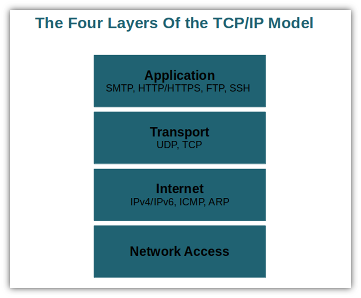
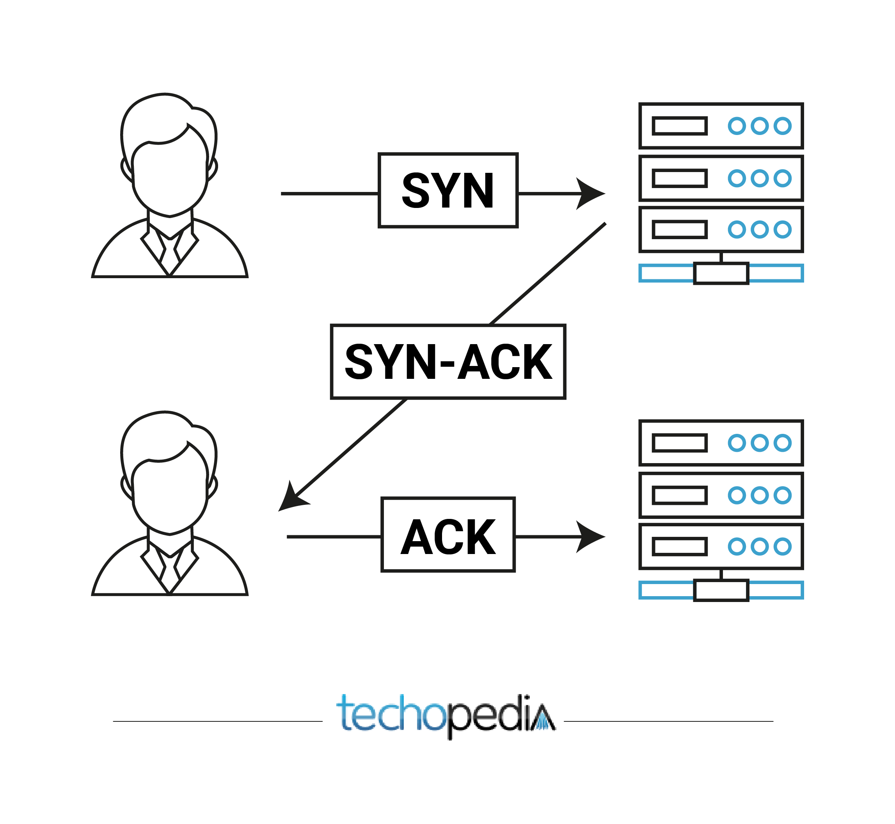

# 1. 인터넷 네트워크
웹 이나 HTTP도 결국 인터넷 네트워크 망을 기반으로 동작한다. 따라서 해당 강의는 시작하기 전 사전지식을 이야기 한다.

## 인터넷 통신
클라이언트와 서버가 통신하기 위해서는 인터넷이 필요하다.

## IP
IP는 인터넷 프로토콜을 의미한다.

### 역할
- 지정한 IP주소(IP Address)에 데이터 전달
- 패킷(Packet)이라는 통신 단위로 데이터 전달
### 패킷
패킷에는 정보들이 담겨있다. (출발지 IP, 목적지 IP, 기타... / 전송 데이터)

### IP 프로토콜의 한계
- 비연결성
	- 패킷을 받을 대상이 없거나 서비스 불능 상태여도 패킷 전송
- 비신뢰성
	- 중간에 패킷이 사라진다면?
		- 데이터는 일정 크기를 넘게 되면 나눠서 전송된다.
	- 패킷이 순서대로 도착하지 않는다면?
		- 나눠서 전송된 데이터는 인터넷 연결망에 상태에 의해 각자 다른 노드(길)로 전송될 수 있다.
- 프로그램 구분
	- 같은 IP를 사용하는 서버에서 통신하는 프로그램이 여러 개라면?

## TCP, UDP
IP 프로토콜만을 사용해서 문제(원활한 통신)를 해결할 수 없었다.

### 인터넷 프로토콜 스택의 4계층

IP의 단점을 TCP가 보완한다. 선물을 주고받는 과정과 비슷하다. 전송하고자 하는 데이터(선물)를 IP로 포장하고 TCP로 한번더 포장하는 것이다.

### TCP/IP 패킷
- IP 패킷: 출발지 IP, 목적지 IP, 기타 ...
- TCP 패킷: 출발지 PORT, 목적지 PORT, 전송제어, 순서, 검증 정보 ...
- 전송 데이터

### TCP 특징
TCP는 전송 제어 프로토콜(Transmission Control Protocol)이다.

- 연결지향 - TCP 3 way handshake (가상 연결) 
	- 진짜로 연결된 것은 아니고 개념적으로만 연결된 것(논리적)을 명심해야 한다. 
- 데이터 전달 보증
	- 이미지를 보면 데이터가 도착했을 때 응답메시지를 보내는 것을 확인할 수 있다.
- 순서 보장
	- 데이터가 순서대로 도착하지 않았다면 재전송을 요청한다.

위 3가지 특징에 근거하여 TCP는 신뢰할 수 있는 프로토콜로 대부분 사용한다.

### UDP 특징
UDP는 사용자 데이터그램 프로토콜(User Datagram Protocol)이다.

- 기능이 거의 없는 프로토콜이다. (하얀 도화지 같다.)
- 연결지향 - TCP 3 way handshake X
- 데이터 전달 보증 X
- 순서 보장 X
- 데이터 전달 및 순서가 보장되지 않지만 단순해서 속도가 빠르다.

> 체크섬(checksum): 중복검사의 한 가지 형태이다.

정리하자면 IP와 거의 같다. (PORT, 체크섬 정도만 추가된다.) 애플리케이션의 추가 작업이 필요한다. 

과거에는 TCP 프로토콜이 전반적으로 많이 사용됐다. 하지만 HTTP 프로토콜의 최적화로 UDP 프로토콜 또한 각광받고 있다.

## PORT
한번에 같은 주소에(도착지) 여러 연결을 하고 싶다면 어떻게 해야할까? IP에 더해 PORT의 개념도 알아야 한다. 
IP는 목적지 서버의 주소고 PORT는 같은 IP 내에서 프로세스를 구분한다. 비유하자면 IP는 아파트 주소, PORT는 몇 동 몇호와 같다.

- 포트는 0 ~ 65535번까지 할당 가능하다. 
  - 0 ~ 1023 포트는 잘 알려진 포트로 사용하지 않는 것이 좋다.
- FTP - 20, 21 / TELNET - 23 / HTTP - 80 / HTTPS - 443

## DNS
DNS는 도메인 네임 시스템(Domain Name System)을 의미한다. 기존 IP만을 사용해서 통신 했을 때는 `127.0.0.1` 과 같이 입력해야 했다. 
하지만 도메인을 등록했을때는 어떨까?

> 도메인명: devmeeple.tistory.com / IP: 127.0.0.1

도메인명으로 통신을 하게된다. 이후 IP가 변경되면 도메인서버에서 변경하면 된다.

## 정리
통신을 원활하게 하기 위해 모든 것이 유기적으로 연결되어 있다. 인터넷 통신을 하기 위해서는 IP가 필요하다. 
하지만 IP만을 사용해서 통신을 하기에는 한계점이 많았다. 이를 보완하고자 TCP를 사용했다. 
주로 TCP를 사용하지만 속도 문제가 중요할 경우, 최근에는 UDP도 많이 사용한다. PORT는 상세주소 같은 것이다. 
DNS는 통신을 편리하게 할 수 있도록 도와준다.